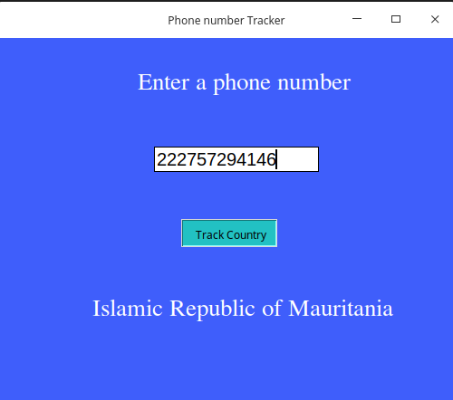

# Python-phonenumber-tracker-App

Hi Guys , This just a simple desktop application made using **Tkinter** for them aim of tracking the country through phone number.

Full Article 
--------------
The full article on how on how to build a phone number tracker is originally published on [my blog](kalebujordan.com) with an article named [How to track phone number in Python](https://kalebujordan.com/how-to-track-phone-number-in-python/) 

## Let's get started 

First of all just clone the repository using git command or using by clicking download zip button 

```bash 
$-> git clone https://github.com/Kalebu/Python-phonenumber-tracker-App
$-> cd Python-phonenumber-tracker-App
$ Python-phonenumber-tracker-App-> 
```

### Requirements 

To successful run this demo application you're required to havesome few libraries installed on your machine 

**Linux installation**
```bash
$~ pip3 install python-tk, pycountry, phone-iso3166
```

**WIndow installation** 

For window you do the same as for linux just without *python-tk* since it come by default with python installation 

**Let's run our App**

Now you're ready to run and begin using the application 

Running our app

```bash
$~ python3 app.py
```

### Output 

You should have the output as hown in the image below 



### Share it and Give it a star 

If you find it useful, you can give it a star and share with your fellow peers on what you have achieved 


Credits
-----------
All the credits to [kalebu](github.com/kalebu)
